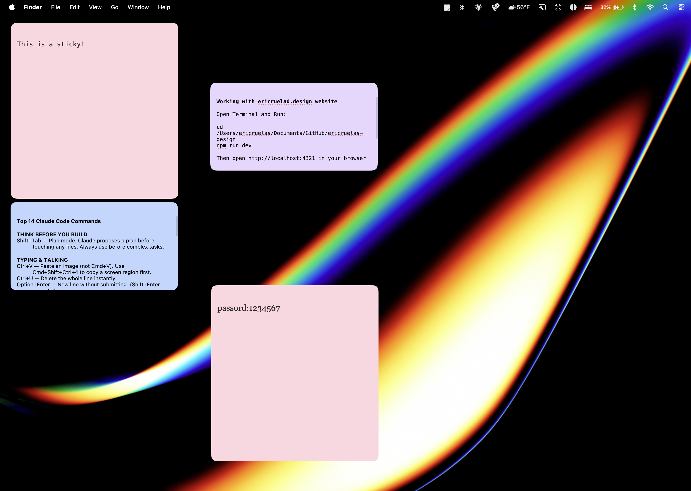

# Notely

macOS Stickies works — but barely. No font control, no real color options, and zero personality. I wanted something more expressive, so I built Notely: a sticky notes app for macOS inspired by FigJam's stickies, with proper customization built in.



## Features

- Multiple notes, each in its own floating window
- Color-coded notes — pick from a set of soft tones
- Rich text — bold, strikethrough, bullet lists, font size, font family
- Clickable links open in your browser
- Notes persist between sessions and remember their position and size
- Frameless, transparent windows — no chrome, just the note

## Install & run

```bash
git clone https://github.com/eric-ruelas/notely.git
cd notely
npm install
npm start
```

Requires [Node.js](https://nodejs.org) and [Electron](https://electronjs.org) (installed via `npm install`).

## Build a macOS app

```bash
npm run build
```

Outputs a `.dmg` installer to `dist/`. Open it and drag Notely to your Applications folder.

Or install directly in one step:

```bash
npm run install-app
```

## Keyboard shortcuts

| Shortcut | Action |
|----------|--------|
| `⌘B` | Bold |
| `⌘⇧X` | Strikethrough |
| `⌘K` | Insert link |

## Stack

- [Electron](https://electronjs.org) — desktop shell
- Vanilla JS + `contenteditable` — no framework
- `contextBridge` + `ipcMain/ipcRenderer` — secure main ↔ renderer communication

## License

MIT
